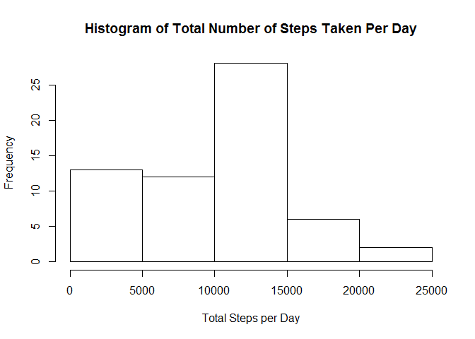
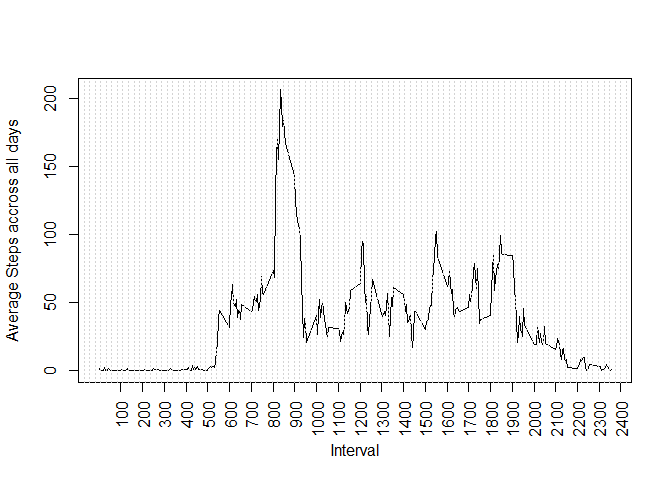
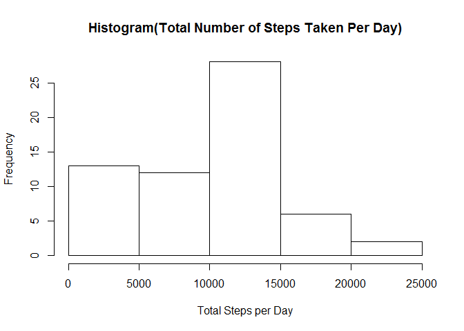
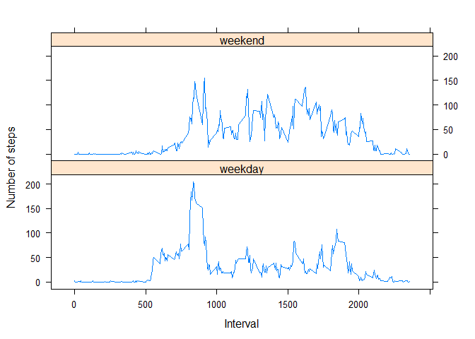

# Reproducible Research: Peer Assessment 1


## Loading and preprocessing the data

```r
library(dplyr)
```

```
## 
## Attaching package: 'dplyr'
## 
## The following object is masked from 'package:stats':
## 
##     filter
## 
## The following objects are masked from 'package:base':
## 
##     intersect, setdiff, setequal, union
```

```r
activity <- read.csv("activity.csv")

activity$date <- as.POSIXct(activity$date)
tbl_df(activity)
```

```
## Source: local data frame [17,568 x 3]
## 
##    steps       date interval
## 1     NA 2012-10-01        0
## 2     NA 2012-10-01        5
## 3     NA 2012-10-01       10
## 4     NA 2012-10-01       15
## 5     NA 2012-10-01       20
## 6     NA 2012-10-01       25
## 7     NA 2012-10-01       30
## 8     NA 2012-10-01       35
## 9     NA 2012-10-01       40
## 10    NA 2012-10-01       45
## ..   ...        ...      ...
```


## What is mean total number of steps taken per day?

```r
bydate <- group_by(activity, date)

###Calculate the total number of steps taken per day
totalstepsperday <- summarize(bydate, total_steps= sum(steps,na.rm = TRUE) )
tbl_df(totalstepsperday)
```

```
## Source: local data frame [61 x 2]
## 
##          date total_steps
## 1  2012-10-01           0
## 2  2012-10-02         126
## 3  2012-10-03       11352
## 4  2012-10-04       12116
## 5  2012-10-05       13294
## 6  2012-10-06       15420
## 7  2012-10-07       11015
## 8  2012-10-08           0
## 9  2012-10-09       12811
## 10 2012-10-10        9900
## ..        ...         ...
```

```r
###histogram of the total number of steps taken each day
hist(totalstepsperday$total_steps,main ="Histogram of Total Number of Steps Taken Per Day", xlab="Total Steps per Day")
```

 

```r
###mean of the total number of steps taken per day
mean_stepsbyday <- summarize(bydate, mean_steps= round(mean(steps,na.rm = TRUE),2))
tbl_df(mean_stepsbyday)
```

```
## Source: local data frame [61 x 2]
## 
##          date mean_steps
## 1  2012-10-01         NA
## 2  2012-10-02       0.44
## 3  2012-10-03      39.42
## 4  2012-10-04      42.07
## 5  2012-10-05      46.16
## 6  2012-10-06      53.54
## 7  2012-10-07      38.25
## 8  2012-10-08        NaN
## 9  2012-10-09      44.48
## 10 2012-10-10      34.38
## ..        ...        ...
```

```r
###median of the total number of steps taken per day
median_stepsbyday <- summarize(bydate, median_steps= round(median(steps,na.rm = TRUE),2))
tbl_df(median_stepsbyday)
```

```
## Source: local data frame [61 x 2]
## 
##          date median_steps
## 1  2012-10-01           NA
## 2  2012-10-02            0
## 3  2012-10-03            0
## 4  2012-10-04            0
## 5  2012-10-05            0
## 6  2012-10-06            0
## 7  2012-10-07            0
## 8  2012-10-08           NA
## 9  2012-10-09            0
## 10 2012-10-10            0
## ..        ...          ...
```


## What is the average daily activity pattern?

```r
byinterval <- group_by(activity,interval)
avgintervalsacrossalldays <- summarize(byinterval,average_steps = round(mean(steps,na.rm =TRUE),2))

###Make a time series plot (i.e. type = "l") of the 5-minute interval (x-axis) and the average number of steps taken, averaged across all days (y-axis)
plot(avgintervalsacrossalldays$interval,avgintervalsacrossalldays$average_steps, type="l",xaxt="n",ylab="Average Steps accross all days",xlab="Interval")
axis(1, at=seq(100,3000,by=100), las=2)
grid(100,NA)
```

 

```r
###Which 5-minute interval, on average across all the days in the dataset, contains the maximum number of steps?
interval_maxnoofsteps<- avgintervalsacrossalldays[which(avgintervalsacrossalldays$average_steps ==max(avgintervalsacrossalldays$average_steps)),]["interval"]
interval_maxnoofsteps
```

```
## Source: local data frame [1 x 1]
## 
##   interval
## 1      835
```


## Imputing missing values

```r
###Calculate and report the total number of missing values in the dataset (i.e. the total number of rows with NAs)
total_na <- sum(is.na(activity))
total_na
```

```
## [1] 2304
```

```r
###Devise a strategy for filling in all of the missing values in the dataset. The strategy does not need to be sophisticated. For example, you could use the mean/median for that day, or the mean for that 5-minute interval, etc.

####made use of the the median of the steps of each intervals across the days to fill the missing values
medianintervalsacrossalldays <- summarize(byinterval,median_steps = median(steps,na.rm =TRUE))

activity2 <- activity


for(x in unique(activity2$interval)){
activity2[which (is.na(activity2$steps) & activity2$interval == x),"steps"]    <- 
        medianintervalsacrossalldays[which(avgintervalsacrossalldays$interval == x),"median_steps"]
}
###Create a new dataset that is equal to the original dataset but with the missing data filled in.
tbl_df(activity2)
```

```
## Source: local data frame [17,568 x 3]
## 
##    steps       date interval
## 1      0 2012-10-01        0
## 2      0 2012-10-01        5
## 3      0 2012-10-01       10
## 4      0 2012-10-01       15
## 5      0 2012-10-01       20
## 6      0 2012-10-01       25
## 7      0 2012-10-01       30
## 8      0 2012-10-01       35
## 9      0 2012-10-01       40
## 10     0 2012-10-01       45
## ..   ...        ...      ...
```

```r
### Make a histogram of the total number of steps taken each day
bydate2 <- group_by(activity2, date)
totalstepsperday2 <- summarize(bydate2, total_steps= sum(steps) )
hist(totalstepsperday2$total_steps,main ="Histogram(Total Number of Steps Taken Per Day)", xlab="Total Steps per Day")
```

 

```r
###mean and median total number of steps taken per day respectively
mean_stepsbyday2 <- summarize(bydate2, mean_steps= round(mean(steps,na.rm = TRUE),2))
median_stepsbyday2 <- summarize(bydate2, median_steps= round(median(steps,na.rm = TRUE),2))

###Do these values differ from the estimates from the first part of the assignment?

####Yes, The values differ for the following days -2012-10-08,2012-11-01,2012-11-04,2012-11-09,2012-11-10,2012-11-14   
          

###What is the impact of imputing missing data on the estimates of the total daily number of steps?
mergeTable <- left_join(totalstepsperday,totalstepsperday2,by = "date" )

####diff column compares the totals steps with previous dataset and list out the dates with different values
mutate(mergeTable,diff=total_steps.y - total_steps.x) %>% arrange(desc(diff))
```

```
## Source: local data frame [61 x 4]
## 
##          date total_steps.x total_steps.y diff
## 1  2012-10-01             0          1141 1141
## 2  2012-10-08             0          1141 1141
## 3  2012-11-01             0          1141 1141
## 4  2012-11-04             0          1141 1141
## 5  2012-11-09             0          1141 1141
## 6  2012-11-10             0          1141 1141
## 7  2012-11-14             0          1141 1141
## 8  2012-11-30             0          1141 1141
## 9  2012-10-02           126           126    0
## 10 2012-10-03         11352         11352    0
## ..        ...           ...           ...  ...
```


## Are there differences in activity patterns between weekdays and weekends?

```r
###1. Create a new factor variable in the dataset with two levels – “weekday” and “weekend” indicating whether a given date is a weekday or weekend day
activity2$weekday <- as.factor(ifelse(weekdays(activity2$date, abbreviate=TRUE) %in% c("Sun","Sat"),"weekend","weekday"))

###2.Make a panel plot containing a time series plot (i.e. type = "l") of the 5-minute interval (x-axis) and the average number of steps taken, averaged across all weekday days or weekend days (y-axis)
byinterval4 <- group_by(activity2,weekday,interval)
avgintervalsacrossalldays_byweekdays <- summarize(byinterval4,average_steps = round(mean(steps),0))

library(lattice)
xyplot(average_steps~interval|weekday, data=avgintervalsacrossalldays_byweekdays, type="l",xlab="Interval",ylab="Number of steps",layout=c(1,2))
```

 

